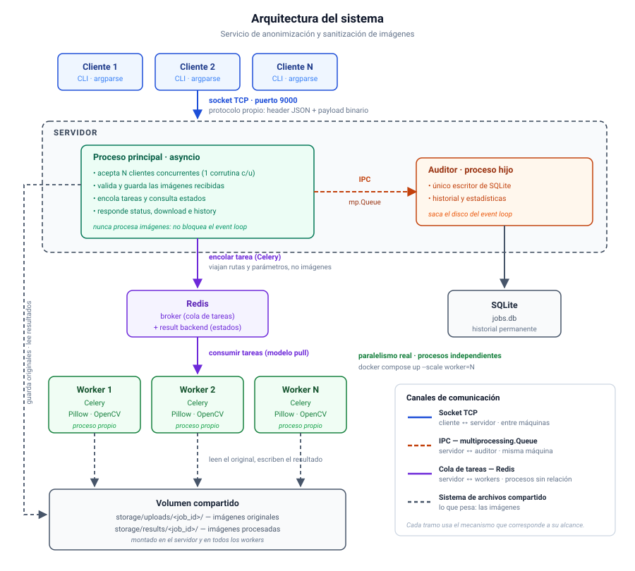

# Arquitectura

Este documento describe **los componentes del sistema, qué hace cada uno y cómo se
comunican entre sí**. La explicación de qué es cada tecnología y por qué se eligió está
en [03_tecnologias.md](03_tecnologias.md).

## 1. Idea central

El sistema tiene **dos mitades que trabajan a ritmos distintos**:

- Una mitad **atiende**: recibe las imágenes, responde consultas, entrega resultados.
  Su trabajo es casi todo espera de red, y tiene que responder rápido siempre, aunque
  haya muchos clientes conectados.
- La otra mitad **procesa**: detecta caras, difumina, recomprime. Su trabajo es cálculo
  puro, tarda segundos por imagen y consume CPU intensivamente.

Si un mismo programa hiciera las dos cosas, mientras procesa una imagen no podría
atender a nadie más. Por eso están **separadas en procesos distintos y unidas por una
cola de tareas**: la mitad que atiende deja pedidos en la cola y sigue atendiendo; la
mitad que procesa los toma a su ritmo.

De esa separación se derivan todas las decisiones que siguen.

## 2. Diagrama



**Cómo leerlo**: el cliente habla con el servidor por un socket TCP. El servidor guarda
la imagen en el volumen compartido y le pide al **proceso de ingreso** que la revise;
solo si la aprueba y no es duplicada, deja la tarea en Redis. Un worker la toma de ahí,
lee la imagen del volumen, la procesa y guarda el resultado en el mismo volumen. El
cliente después consulta el estado y descarga el resultado, siempre a través del
servidor.

Notar que **el cliente solo conoce al servidor**: no sabe que existen Redis, los workers
ni el proceso de ingreso. Toda la complejidad interna queda detrás de una única dirección y un
único puerto, y eso permite cambiar la mitad de atrás —agregar workers, cambiar el
broker— sin tocar el cliente ni el protocolo.

## 3. Los canales de comunicación

El sistema usa **cinco canales distintos**, cada uno con un alcance diferente. Esta
tabla es el resumen de la arquitectura:

| Canal | Une | Alcance | Qué transporta |
|---|---|---|---|
| **Socket TCP** | cliente ↔ servidor | entre máquinas | pedidos e imágenes |
| **multiprocessing.Queue** ×2 | servidor ↔ proceso de ingreso | misma máquina, procesos emparentados | pedidos de revisión, sus respuestas y los eventos |
| **Redis** | servidor ↔ workers | entre máquinas, procesos sin relación | invocaciones y estados |
| **Volumen compartido** | servidor ↔ workers ↔ ingreso | mismo sistema de archivos | los archivos de imagen |
| **SQLite** | ingreso → servidor | mismo sistema de archivos | el historial ya persistido |

La lógica del reparto: los sockets son el único mecanismo que cruza la red hacia
clientes externos; las Queues son lo más simple y directo entre dos procesos
emparentados, pero no funcionan fuera de la máquina; Redis coordina procesos que ni se
conocen; y el disco compartido lleva lo que pesa, porque ninguno de los otros canales
está pensado para megabytes.

La última fila merece una aclaración, porque no es un canal en el sentido habitual: los
dos procesos **no se hablan** a través de la base, pero como uno escribe y el otro lee,
la información fluye igual en esa dirección. Es el camino por el que el servidor
recupera lo que ya no tiene en memoria — el historial, y los trabajos en curso después
de un reinicio.

### 3.1 El IPC en detalle: dos colas y una correlación

El servidor y el proceso de ingreso se comunican con **dos `multiprocessing.Queue`**,
una en cada sentido:

```
                     cola de PEDIDOS  ──────────────►
   ┌──────────────┐   {kind: "intake", job_id, …}   ┌──────────────────┐
   │   SERVIDOR   │   {kind: "event",  job_id, …}   │ PROCESO DE       │
   │  (asyncio)   │                                  │ INGRESO          │
   └──────────────┘   ◄──────  cola de RESPUESTAS   └──────────────────┘
                       {job_id, result: "new" | "duplicate" | "invalid"}
```

**Por la cola de pedidos viajan dos tipos de mensaje.** Los de tipo `event` son
*sin respuesta*: el servidor los deposita y sigue, sin esperar nada. Los de tipo
`intake` **sí esperan respuesta**, y por eso existe la segunda cola.

**Cómo confirma el hijo que la imagen es válida.** La cola de respuestas es de solo
lectura para el servidor, y `get()` sobre ella bloquea — no se puede llamar dentro del
event loop. El mecanismo es el siguiente:

```python
# Al arrancar el servidor: un diccionario de pedidos esperando respuesta
pendientes: dict[str, asyncio.Future] = {}

# Corrutina de fondo que corre todo el tiempo
async def bomba_de_respuestas():
    while True:
        resp = await asyncio.to_thread(respuestas.get)   # bloquea en un hilo aparte
        fut = pendientes.pop(resp["job_id"], None)
        if fut and not fut.done():
            fut.set_result(resp)                          # despierta al submit

# En el handler de submit, dentro de la corrutina que atiende a ese cliente
fut = asyncio.get_running_loop().create_future()
pendientes[job_id] = fut
pedidos.put({"kind": "intake", "job_id": job_id, "user": user,
             "op": op, "params": params, "path": ruta})
resp = await asyncio.wait_for(fut, timeout=30)            # ← acá espera la confirmación
```

Las piezas son tres. El **`job_id` funciona como identificador de correlación**: es lo
que permite saber a qué pedido corresponde cada respuesta, porque puede haber varios
`submit` en curso al mismo tiempo. El **`Future`** es el punto donde la corrutina del
cliente queda suspendida sin bloquear a nadie más. Y la **bomba de respuestas** es una
única corrutina de fondo que hace de puente entre el mundo bloqueante de la cola y el
event loop, usando `asyncio.to_thread` para que la espera ocurra en un hilo.

El `wait_for` con tiempo límite cubre el caso en que el hijo muera en el medio: el
`submit` falla con error en lugar de quedarse esperando para siempre, y el servidor
relanza el proceso.

## 4. Componentes

### 4.1 Cliente (CLI)

Programa que ejecuta el usuario desde su terminal. Configura la conexión y la identidad
por argumentos de línea de comandos, valida el archivo localmente antes de enviarlo
(que exista, que el formato sea soportado, que no exceda el tamaño máximo), abre la
conexión con el servidor y ejecuta la acción pedida: enviar una imagen, consultar un
estado, descargar un resultado o listar el historial.

Está construido sobre **asyncio** en todas sus operaciones, no solo en la espera: usa los
mismos *streams* que el servidor para leer y escribir en el socket, de modo que el envío
y la recepción de archivos grandes nunca bloquean.

Con `--wait` aprovecha una sola conexión para toda la secuencia: envía la imagen,
consulta el estado periódicamente con `await asyncio.sleep(...)` y descarga el resultado
apenas está listo.

### 4.2 Servidor — proceso principal

Es el único punto de contacto de los clientes y **la pieza que nunca debe bloquearse**.
Atiende N conexiones concurrentes sobre un solo hilo con asyncio, escuchando en un
**socket dual-stack** que acepta clientes IPv4 e IPv6 sobre el mismo puerto.

Sus responsabilidades:

- Aceptar conexiones y leer los pedidos según el protocolo (sección 5).
- Validar la **forma** de cada pedido: operación existente, campos presentes, tamaño
  dentro del límite. **No mira el contenido de la imagen** — de eso se encarga el
  proceso de ingreso.
- **Guardar la imagen original** en el volumen compartido, bajo `uploads/<job_id>/`.
- **Pedirle al proceso de ingreso que la revise** y esperar su confirmación antes de
  responderle al cliente.
- **Encolar la tarea** en Celery —solo si el ingreso la aprobó y no es duplicada—
  pasándole la ruta y los parámetros.
- **Notificar los eventos posteriores** al proceso de ingreso por la
  `multiprocessing.Queue`.
- **Supervisar al proceso de ingreso** y relanzarlo si muere.
- Mantener un **índice en memoria** de los trabajos aceptados desde que arrancó (usuario,
  operación, estado, ruta de salida). Es lo que le permite responder por un trabajo recién
  creado sin depender de que el proceso de ingreso ya lo haya persistido.
- Responder consultas de estado e historial resolviendo el trabajo contra ese índice y,
  si no está ahí, contra SQLite en modo solo lectura. Consulta el result backend de Celery
  **solo cuando el trabajo sigue en curso**.
- Servir las descargas, leyendo el resultado del volumen.
- Vigilar los trabajos en curso (sección 4.5).
- Apagarse ordenadamente ante SIGINT/SIGTERM: dejar de aceptar conexiones, cerrar las
  abiertas y avisar al proceso de ingreso para que cierre la base.

Lo que el servidor **no** hace, y es deliberado: **no procesa imágenes ni siquiera las
abre**. Cualquier trabajo de CPU dentro del event loop congelaría a todos los clientes
conectados, y decodificar contenido no confiable podría directamente tirar abajo el
proceso. Para el servidor, una imagen es una cantidad de bytes que recibe, guarda y
entrega — nunca interpreta lo que hay adentro.

### 4.3 Proceso de ingreso — proceso hijo

Proceso que el servidor lanza al arrancar. Es **el único que manipula el contenido de
las imágenes fuera de los workers**, y **el único que escribe en SQLite**.

Cumple dos funciones bien distintas:

**1. Revisar cada imagen que entra**, antes de que el servidor le conteste al cliente:

- **Verificar** que sea una imagen válida y no esté corrupta, abriéndola con Pillow.
- **Calcular el SHA-256** de su contenido.
- **Buscar duplicados**: si ese mismo usuario ya procesó ese mismo contenido con esa
  misma operación y esos mismos parámetros, el trabajo no hace falta.
- Si es nueva, **registrar la fila del trabajo** en SQLite.

**2. Persistir los eventos** del ciclo de vida —encolado, iniciado, terminado,
fallado— que el servidor le va enviando después.

#### El recorrido de una imagen que entra

```
1. El cliente envía la imagen.

2. El servidor genera el job_id y escribe los bytes en
   storage/uploads/<job_id>/.

3. El servidor le pasa al proceso de ingreso, por la cola de pedidos:
   job_id, usuario, operación, parámetros y la ruta del archivo.

4. El ingreso ABRE LA IMAGEN.
       │
       ├── no es válida ──► responde "invalid"
       │                    → el servidor borra el archivo
       │                    → NO se guarda nada en la base
       │                    → responde INVALID_IMAGE al cliente.     FIN
       │
       └── es válida ─────► sigue ↓

5. El ingreso calcula el sha256 del contenido del archivo.

6. El ingreso busca duplicados: mismo usuario, mismo sha256,
   misma operación, mismos parámetros, y en estado DONE.
       │
       ├── ENCUENTRA uno ──► responde "duplicate", of: b8e1
       │                     → el servidor borra el archivo recién recibido
       │                       (el original ya está guardado bajo b8e1)
       │                     → NO encola nada en Celery
       │                     → NO se inserta una fila nueva
       │                     → responde al cliente el job_id b8e1, ya en DONE
       │                       y con deduplicated: true.               FIN
       │
       └── NO encuentra ───► INSERTA la fila del trabajo en SQLite,
                             con el sha256 y estado QUEUED    ← ACÁ SE PERSISTE
                             → responde "new"
                             → el servidor encola la tarea en Celery,
                               la registra en su índice en memoria
                               y envía el evento `queued`
                             → responde al cliente el job_id nuevo,
                               en estado QUEUED.                       FIN
```

Tres cosas que conviene retener de este recorrido. **La fila del trabajo se escribe en el
paso 6 y solo en la rama "nueva"**: una imagen inválida no deja rastro en la base, y una
duplicada tampoco crea una fila propia. **El archivo recibido se borra en dos de los tres
desenlaces**, porque es imprescindible tenerlo en disco para poder hashearlo, pero deja
de servir si el trabajo no prospera. Y **el `job_id` que recibe el cliente no siempre es
el que el servidor generó**: en el caso duplicado es el del trabajo anterior.

#### Por qué es un proceso y no un hilo

Esta es la justificación central del componente, y conviene tenerla precisa: **la única
cosa que un proceso ofrece y un hilo no es el aislamiento ante fallas**.

Escribir en SQLite fuera del event loop se podría resolver perfectamente con un hilo,
porque las escrituras a disco liberan el GIL. Si el proceso existiera solo para eso,
estaría de más.

Lo que sí exige un proceso separado es **decodificar imágenes que vienen de afuera**.
Pillow y OpenCV son, por dentro, código nativo en C: una imagen malformada —por error o
a propósito— puede provocar una caída del intérprete, no una excepción de Python que se
pueda atrapar con un `try`. Si eso ocurriera dentro del servidor, se caerían **todas las
conexiones abiertas** de todos los clientes, incluidas las que estuvieran en medio de
una transferencia.

En un proceso aparte, esa caída queda contenida: muere el hijo, el servidor ni se entera
y lo vuelve a levantar. Por eso **el servidor nunca abre una imagen**: todo contacto con
contenido no confiable ocurre en el proceso de ingreso o en los workers, ambos aislados.

#### Supervisión

El aislamiento sirve solo si alguien repone lo que se cae. El servidor **vigila que el
proceso hijo siga vivo** y, si murió, lo relanza. Los pedidos que estaban esperando
respuesta se resuelven con error, y el cliente recibe un fallo en ese `submit` en lugar
de quedarse colgado.

Como el hijo revisa **una imagen por vez**, la que estaba en curso cuando murió queda
identificada sin ambigüedad: es la que provocó la caída.

#### Por qué escribe la base y no la lee

El servidor **lee SQLite por su cuenta**, en modo solo lectura, para el historial y para
recuperar trabajos tras un reinicio. Eso no rompe nada: **SQLite admite muchos lectores
simultáneos**, la restricción es solo sobre los escritores. Manteniendo un único escritor
—este proceso— el problema de concurrencia no se presenta, y el servidor se ahorra un
viaje de ida y vuelta para cada consulta.

### 4.4 Workers

Procesos independientes que ejecutan las operaciones sobre las imágenes. **No son
procesos hijos del servidor**: se levantan por separado, en sus propios contenedores, y
lo único que los vincula con el servidor es que apuntan al mismo Redis.

Cada worker toma mensajes de la cola por su cuenta, lee la imagen del volumen
compartido, la procesa con Pillow y OpenCV, escribe el resultado en `results/<job_id>/`
y reporta el estado y las rutas al result backend.

Acá está el **paralelismo real** del sistema: son procesos separados, con intérpretes y
GILs separados, así que N workers procesan N imágenes simultáneamente en N núcleos.

La operación `sanitize` se implementa como una cadena de tareas (anonymize → clean →
compress), donde cada etapa recibe la salida de la anterior.

### 4.5 Monitor de trabajos en curso

Una corrutina de fondo dentro del servidor, necesaria por una limitación concreta: **los
workers no pueden avisarle al proceso de ingreso**. Viven en otros contenedores, y la
`multiprocessing.Queue` solo comunica procesos emparentados de la misma máquina.

El monitor mantiene la lista de los trabajos en vuelo y consulta periódicamente su estado
en el result backend. Detecta **dos transiciones**: cuando un worker toma el trabajo
(evento `started`, que es lo que permite informar `PROCESSING`) y cuando termina (`done`
o `failed`). En ambos casos envía el evento al proceso de ingreso y actualiza el índice en memoria;
al terminar, además, saca el trabajo de la lista de vigilancia.

#### Recuperación al reiniciar el servidor

El índice en memoria es volátil: si el servidor se reinicia, se olvida de los trabajos que
estaba vigilando. Pero esos trabajos **siguen ejecutándose**, porque los workers son
procesos independientes que no se enteran de la caída — que es justamente la propiedad
que buscábamos al desacoplarlos.

El problema sería que nadie detecte su finalización, y quedarían marcados como
`PROCESSING` para siempre en el historial. Por eso, **al arrancar, el servidor consulta
SQLite y carga los trabajos en estado no terminal** de vuelta en el índice y en la lista
del monitor. La vigilancia se retoma donde había quedado, y los trabajos que terminaron
durante la caída se resuelven en la primera consulta.

### 4.6 Almacenamiento

Tres lugares, tres roles:

- **Volumen compartido (`storage/`)** — los archivos: originales en `uploads/<job_id>/`,
  resultados en `results/<job_id>/`. Montado en el servidor, en el proceso de ingreso y
  en todos los workers. Esa condición es la que permite que por las colas viajen solo
  rutas: quien recibe una puede abrir el archivo directamente.
- **Redis** — el estado **vivo** de las tareas. Efímero: deja de importar poco después
  de que el trabajo termina.
- **SQLite (`jobs.db`)** — el historial **permanente**.

Cada dato en el lugar que le corresponde: archivos pesados al disco, estado transitorio
a Redis, historia a la base de datos.

A esos tres se suma el **índice en memoria del servidor** (sección 4.2), que no es
almacenamiento sino una caché: guarda los trabajos de la ejecución en curso para poder
responder sin esperar al proceso de ingreso ni ir al disco. Se pierde al reiniciar, y se reconstruye
desde SQLite.

### 4.7 Flower (opcional)

Panel web que viene con Celery y se levanta como un servicio más del `docker-compose`.
Muestra en tiempo real los workers conectados, las tareas en curso, las completadas y las
fallidas, con sus tiempos de ejecución.

No requiere escribir código: se conecta al mismo broker que el resto del sistema y lee de
ahí. Cumple el requisito opcional de entorno visual y, sobre todo, hace **observable** el
comportamiento de la cola durante la demostración — se ve cómo se reparten las tareas
entre workers al escalarlos, y cómo una tarea se reintenta cuando un worker muere.

## 5. Protocolo cliente-servidor (resumen)

Los sockets garantizan que la información llegue íntegra, pero no definen **qué** enviar
ni **cómo interpretarlo**. Eso lo define un **protocolo propio de capa de
aplicación**, construido sobre TCP.

La especificación completa está en [04_protocolo.md](04_protocolo.md). Lo esencial:

**Identidad.** Cada `submit` genera un **`job_id`** (UUID v4) que el cliente conserva
para consultar y descargar. Cada trabajo produce **a lo sumo un archivo de salida**, así
que el `job_id` alcanza para direccionarlo. Los datos que devuelve la operación —caras
detectadas, metadatos eliminados, el informe de `inspect`— viajan en la respuesta de
`status`, sin necesidad de descargar nada. Un trabajo pertenece al usuario que lo creó y
solo él puede consultarlo.

**Formato.** Todos los mensajes usan *length-prefixed framing*: 4 bytes con la longitud
del header, header JSON con los datos del pedido, y payload binario opcional cuyo tamaño
se declara en el header. Es necesario porque TCP entrega un flujo continuo sin marcas
que separen un mensaje del siguiente.

**Diálogo.** Pedido → respuesta, siempre iniciado por el cliente, uno por vez. Una
conexión por ejecución del cliente, que puede transportar varios pedidos. Cuatro tipos:
`submit`, `status`, `download`, `history`.

## 6. Mensajes hacia los workers

Por la cola viajan **rutas y parámetros, nunca imágenes**. El broker está diseñado para
mensajes de control de unos pocos bytes; hacerle transportar megabytes lo convertiría en
el cuello de botella del sistema.

Mensaje de ida (servidor → worker):

```json
{
  "task": "tasks.anonymize",
  "id": "c1f2a9…",
  "args": ["a3f7b2…", "/storage/uploads/a3f7b2…/foto.jpg", "/storage/results/a3f7b2…"],
  "kwargs": {"mode": "blur", "strength": 15}
}
```

La operación **es el nombre de la tarea** (`tasks.anonymize`, `tasks.compress`), no un
argumento: hay una tarea por operación.

Resultado de vuelta (worker → result backend):

```json
{"output": "/storage/results/a3f7b2…/out.jpg", "faces_detected": 3, "bytes": 284915}
```

Otra vez rutas y metadatos. El cliente obtiene el archivo por el socket cuando hace
`download`, nunca a través de Redis.

Notar que la ruta de salida **no llega al cliente**: es interna del sistema. El servidor
la usa para servir la descarga, pero al responder una consulta de estado la descarta y
solo informa si hay archivo disponible.

**Condición que esto impone**: la ruta solo sirve si ambos lados ven el mismo sistema de
archivos, y por eso el volumen está montado en el servidor y en los workers. Es el
límite de escalabilidad conocido del diseño: para distribuir workers en máquinas sin ese
volumen habría que usar almacenamiento en red (NFS) o de objetos (S3).

## 7. Modelo de datos (SQLite)

Dos tablas: los trabajos y sus eventos. Las estadísticas no se almacenan — se calculan
con consultas cuando se piden, evitando datos duplicados que puedan quedar
inconsistentes.

```sql
CREATE TABLE jobs (
  id          TEXT PRIMARY KEY,      -- job_id (UUID v4)
  user        TEXT NOT NULL,
  op          TEXT NOT NULL,         -- anonymize | clean | convert | compress | sanitize | inspect
  params      TEXT NOT NULL,         -- JSON canónico: claves ordenadas
  sha256      TEXT NOT NULL,         -- huella del contenido de la imagen de entrada
  filename    TEXT,                  -- nombre original, solo informativo
  status      TEXT NOT NULL,         -- QUEUED | PROCESSING | DONE | ERROR
  error       TEXT,
  result_path TEXT,
  created_at  TEXT NOT NULL,
  finished_at TEXT
);

-- Índice que sostiene la búsqueda de duplicados: sin él, cada submit
-- recorrería la tabla entera.
CREATE INDEX idx_dedup ON jobs(user, sha256, op, params);

CREATE TABLE events (
  id      INTEGER PRIMARY KEY AUTOINCREMENT,
  job_id  TEXT NOT NULL REFERENCES jobs(id),
  kind    TEXT NOT NULL,             -- queued | started | done | failed
  ts      TEXT NOT NULL,
  detail  TEXT
);
```

### 7.1 La búsqueda de duplicados

La consulta que hace el proceso de ingreso por cada imagen que entra:

```sql
SELECT id FROM jobs
 WHERE user = ? AND sha256 = ? AND op = ? AND params = ? AND status = 'DONE'
 LIMIT 1;
```

Tres decisiones están codificadas ahí:

**La identidad de un trabajo son cuatro campos, no solo el hash.** La misma foto
difuminada con `strength=15` da un resultado distinto que con `strength=30`, así que la
operación y sus parámetros forman parte de la identidad tanto como el contenido. Para que
la comparación de `params` funcione como texto, se guarda en **forma canónica**: JSON con
las claves siempre ordenadas.

**Solo se reutilizan trabajos en estado `DONE`.** Uno que falló no sirve, y uno que está
en curso tampoco: se procesa de nuevo. Esperar a que termine el que ya está corriendo
sería más eficiente, pero agrega una coordinación que no vale la pena en esta versión.

**El filtro por `user` es una decisión de privacidad, no de eficiencia.** Reutilizar el
trabajo de otro usuario le revelaría que esa persona procesó la misma imagen. En una
aplicación cuyo objeto es proteger la privacidad, eso sería contradictorio.

Como consecuencia, en la tabla pueden convivir varias filas con el mismo `sha256` y
distinto `op`: es la misma imagen procesada de maneras diferentes, y son trabajos
legítimamente distintos.

## 8. Módulos del código

```
final_comp2/
├── docs/
├── app/
│   ├── common/
│   │   ├── protocol.py      # framing (pack/unpack de frames), tipos de mensaje,
│   │   │                    #   constantes — único lugar donde se define el protocolo
│   │   └── config.py        # rutas de storage, límites (tamaño máx.), defaults
│   ├── client/
│   │   └── client.py        # argparse + asyncio streams; una función por acción
│   ├── server/
│   │   ├── cli.py           # argparse, arranque: lanza el proceso de ingreso, recupera trabajos
│   │   │                    #   en curso, instala manejo de señales, inicia el loop
│   │   ├── server.py        # asyncio.start_server + un handler por tipo de mensaje
│   │   ├── registry.py      # resolución de trabajos: índice en memoria + lecturas
│   │   │                    #   a SQLite (solo lectura)
│   │   ├── jobs.py          # puente con Celery: encolar, consultar estado,
│   │   │                    #   corrutina de monitoreo de trabajos en vuelo
│   │   ├── ipc.py           # las dos colas, la bomba de respuestas y la
│   │   │                    #   supervisión del proceso hijo
│   │   └── intake.py        # proceso hijo: verificación de imágenes, hash,
│   │                        #   deduplicación y escritura de SQLite
│   └── worker/
│       ├── celery_app.py    # instancia y configuración de Celery
│       └── tasks.py         # tareas Pillow/OpenCV, una por operación + sanitize
├── storage/                 # volumen compartido (uploads/, results/)
├── docker-compose.yml
├── Dockerfile
└── requirements.txt
```

**Regla de dependencias**: `client` y `server` solo comparten `common/`; `worker` no
importa nada del servidor (solo `common/config`). Esto garantiza que cada componente
pueda desplegarse por separado, que es la condición de un sistema distribuido.

## 9. Flujo completo de un trabajo

1. El cliente parsea los argumentos, valida el archivo y abre el socket TCP.
2. Envía el pedido `submit` (header JSON + bytes de la imagen).
3. El servidor —una corrutina por cliente— lee el pedido sin bloquear el loop, valida su
   forma, genera el `job_id` y guarda los bytes en `storage/uploads/<job_id>/`.
4. Le pide al **proceso de ingreso** que revise la imagen y espera su respuesta.
5. El ingreso verifica que sea una imagen válida, calcula su `sha256` y busca
   duplicados. Devuelve una de tres cosas:
   - **inválida** → el servidor borra el archivo y responde `INVALID_IMAGE`. Fin.
   - **duplicada** → el servidor borra el archivo recién recibido y le responde al
     cliente el `job_id` del trabajo anterior, ya en `DONE`. **No encola nada.** Fin.
   - **nueva** → el ingreso ya dejó registrada la fila en SQLite; el flujo continúa.
6. El servidor encola la tarea en Celery —un mensaje chico en Redis con la ruta y los
   parámetros—, registra el trabajo en su **índice en memoria**, envía el evento
   `queued` y responde el `job_id` al cliente.
7. Un worker toma la tarea, lee la imagen del volumen, la procesa, escribe el resultado
   en `storage/results/<job_id>/` y reporta al result backend.
8. El monitor del servidor detecta las transiciones —primero `started`, después `done` o
   `failed`—, actualiza el índice y envía los eventos al proceso de ingreso, que los
   persiste en SQLite.
9. El cliente consulta `status` y descarga con `download` (o todo junto con `--wait`).

El paso 5 es el más ramificado del sistema; su recorrido completo, con los tres
desenlaces y lo que se persiste en cada uno, está en la sección 4.3.

## 10. Cumplimiento de requisitos

| Requisito obligatorio | Dónde se cumple |
|---|---|
| Sockets, clientes múltiples concurrentes | `server.py` — `asyncio.start_server` sobre TCP, dual-stack IPv4/IPv6 |
| Mecanismos de IPC | dos `mp.Queue` (pedidos y respuestas) entre servidor e `intake.py` |
| Asincronismo de I/O | asyncio en el servidor y en el cliente (streams en ambos) |
| Cola de tareas distribuidas | Celery + Redis, tareas en `tasks.py` |
| Parseo de argumentos CLI | argparse en `client/cli.py` y `server/cli.py` |

| Adicional | Dónde |
|---|---|
| Despliegue en contenedores | `docker-compose.yml` (server, redis, workers, flower) |
| Base de datos | SQLite, escrita por el proceso de ingreso |
| Celery para tareas en paralelo | workers escalables + `sanitize` encadenado |
| Entorno visual | Flower, panel web de la cola (sección 4.7, opcional) |
